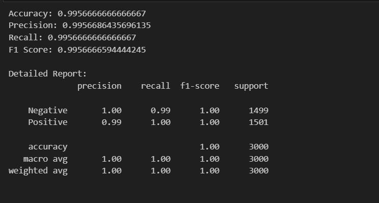
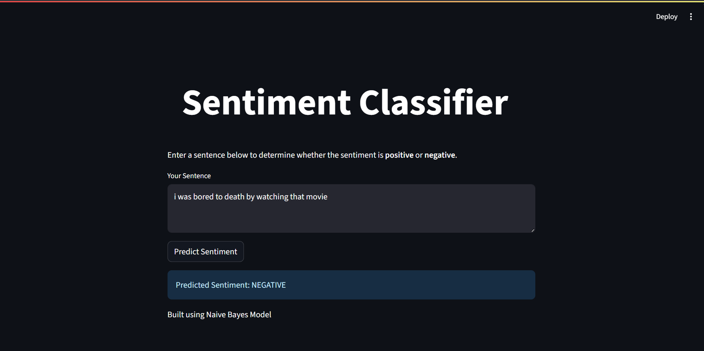

# Sentiment Analysis using Naive Bayes Classifier (NLTK)
## Overview
This project demonstrates sentiment analysis on Twitter data using the Naive Bayes algorithm from the NLTK library. The classifier predicts whether a given tweet has a positive or negative sentiment. The model is trained on the twitter_samples dataset provided by NLTK and evaluated using common classification metrics.

## Live Demo

You can access the deployed Streamlit app using the link below:

[Click here to try the Sentiment Analysis App](https://sentiment-analysis-rb72ekvfvjqffq5lbjlqdj.streamlit.app/)

## Dataset
The dataset used is the twitter_samples corpus from the NLTK library, which contains:

5,000 positive tweets

5,000 negative tweets

## Preprocessing Steps
To ensure clean and meaningful input to the model, the following preprocessing techniques were applied:

### Tokenization

Tweets are split into individual words using word_tokenize.

### Noise Removal

Removed URLs using regular expressions

Removed Twitter handles (e.g., @user)

### Part-of-Speech (POS) Tagging

Used NLTK’s pos_tag to assign parts of speech to each word to aid in better lemmatization.

### Lemmatization

Used WordNetLemmatizer to convert each word to its base form based on its POS tag (noun, verb, adjective).

### Stop Word Removal

Common words that do not contribute to sentiment (like “is”, “the”, “and”) were removed using NLTK’s stopwords list.

###Punctuation Removal

Tokens that are purely punctuation were discarded.

## Feature Extraction
Each cleaned tweet is converted into a dictionary of binary features indicating the presence of each word.
Example:

["great", "movie", "love"] → {"great": True, "movie": True, "love": True}
This format is suitable for training the Naive Bayes classifier in NLTK.

##Model Training
Each tweet is labeled as “Positive” or “Negative”

Combined and shuffled the labeled data

Split into:

Training set: 7,000 tweets

Testing set: Remaining tweets

Trained using NaiveBayesClassifier.train() from NLTK

## Evaluation Metrics
Evaluated the model using the following metrics from sklearn:

Accuracy

Precision

Recall

F1 Score

Classification report with detailed per-class performance

## Sample Predictions
After training, the model was tested on custom user-defined tweets such as:

“I ordered just once from TerribleCo, they screwed up, never used the app again.” → Negative

“I am going for this anime and I am super excited.” → Positive

“I am bored and I would like to watch a movie.” → Negative

## Model Saving
The trained classifier was serialized and saved as naive_bayes_model.pkl using pickle so it can be reused or integrated into a web app ( with Streamlit).

## Web Interface

Below is a screenshot of the web interface built using Streamlit:

## Future Improvements
Add neutral sentiment class

Experiment with additional classifiers (Logistic Regression, SVM)

Visualize word frequencies and prediction confidence